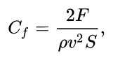

# Моделирование траектории полёта снаряда

При создании математической модели полёта снаряда необходимо учитывать ряд важных параметров, влияющих на дальность полёта снаряда и на форму траектории его полёта.
К таким параметрам относятся:  
1. Начальная скорость снаряда - в зависимости от начальной скорости может сильно изменяться дальность полёта снаряда, а также его сопротивление воздуху, так как при движении на дозвуковых и сверхзвуковых скоростях сопротивление влияет на полёт снаряда по-разному.
2. Угол бросания снаряда - помимо влияния на дальность полёта снаряда также влияет на время полёта, так как изменяя лишь угол бросания возможно добиться попадания в цель двумя разными траекториями, которые будут отличаться временем полёта снаряда.
3. Скорость и плотность воздуха, которые влияют на сопротивление снаряда, в частности, плотность воздуха отличающаяся на разных высотах также влияет на дальность и время полёта снаряда.
4. Коэффициент сопротивления снаряда - величина изменяющаяся в зависимости от формы снаряда, его лобового сечения, а также объёма и площади поверхности, необходим для получения функции сопротивления снаряда, участвующей в расчётах трнаектории.
5. Масса снаряда - параметр влияющий на стартовые баллистические параметры, влияет на количество энергии требуемой при выделении пороховых газов для разгона снаряда до стартовой скорости.

Для расчётов траекторий и дальностей снарядов были придуманы различные методы, 
которые в 19 - начале 20 веков основывались на эмпирических данных,
одним из самых популярных методов тех времён является метод нахождения по закону Сиаччи
или вычисление по таблицам Сиаччи.


Для получения траектории полёта снаряда необходимо найти функцию, которая описывает данную траекторию, но так как некоторые параметры являются индивидуальными для каждого снаряда, для нахождении траектории полёта снаряда в воздухе необходимо решить систему дифференциальных уровлений первого порядка. Траектория как и в случае нахождения траектории в безвоздушном пространстве будет параболой, но в данном случае ветви параболы будут несиметричны.

Взяв основные законы механики и силы сопротивления, действующие на снаряд И.А. Балаганский, основываясь на трудах Шапиро Я.М. в своём учебном пособии "Основы баллистики и аэродинамики" приводит систему дифференциальных уравнений для расчёта параметров снаряда


В результате интегрирования получаем данные для построения траектории полёта
снаряда, в данном случае начальная скорость составила 300м/с,
а угол бросания 20 градусов, при коэфициенте сопротивления 0.95.


По данным полученным моделью можно видеть, что дальность полёта прямо пропорциональна скорости снаряда, но в то же время кривизна траектории также резко растёт, что приводит к почти вертикальному падению снаряда при больших скоростях старта.

---

 Теперь оценим изменение траектории при изменении угла метания, скорость метания возьмём 300 м/с при сопротивлении 0.95.

 В результате также дальность полёта пропорциональна углу метания снаряда, при этом при увеличении угла резко растёт максимальная высота полёта, что приводит к увеличению времени полёта снаряда.

---

Последним параметром будет коэффициент сопротивления.

В случае корэффициеннта сопротивления дальность и высота полёта растёт при уменьшении коэффициента, то есть траектория становится ближе к эталлоной параболе в безвоздушном пространстве.

# Расчёт коэфициента сопротивления

Коэфициент сопротивления формы производится по следующей формуле  


В данной формуле основным неизвестным параметром является сила, которая действует соосно траектории полёта снаряда, которая получается либо эмпирически, либо симуляционно.

Для получения данных из симулятора необходимо создать 3D модель снаряда и произвести симуляцию потоков (жидкостей/газов).

Для этого была создана приближённая 3D модель снаряда БР-350А в САПР SolidWorks.


Далее для получения данных была произведена симуляция потоков воздуха, имитирующих полёт снаряда в воздушной среде.


По результатам симуляции была получена сила, действующая на снаряд, которая составила 500Н
Далее подставив значение скорости потока из симуляции, составлявшей 600 м/с получим по приведённой раньше формуле коэфициент С(i)

```
i = 3.27
```

# Запуск программы

Программа для определения траектории полёта была написана на Python 3.7 с 
использованием библиотек numpy и manim, для корректной работы требуется 
установить ffmpeg и LaTex. 
При запуске программы из командной строки указываются 3 аргумента угол бросания,
скорость и коэффициент сопротивления снаряда, по результату работы программы
в рабочей дериктории будет создана папка media, в которой будут папки images 
и videos, содержащие результаты работы программы, также программа по завершению 
сама запустит видео с результатом. 

Публикации и пособия использованные в процессе разработке приложены в репозитории в папке papers.

Ссылка на репозиторий 
https://github.com/Zimus-a/Ballistics

